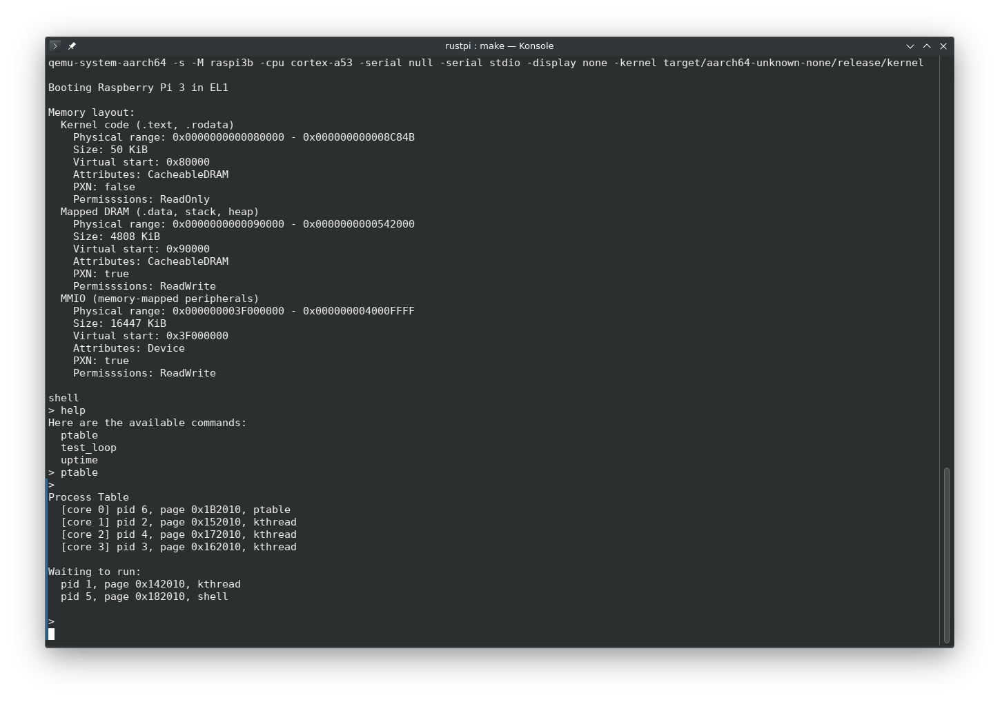

# RustPi
A Raspberry Pi 3 in Rust on bare metal environment written in Rust! 



## About
A simple bare-metal environment for Raspberry Pi 3. This project contains things that I've learned from experimenting with OS development. Based heavily on Andre Richter's fantastic [Rust Raspberry Pi OS tutorials](https://github.com/rust-embedded/rust-raspberrypi-OS-tutorials).


This is a Rust re-write of a similar project I started in C [available here](https://github.com/WillFarris/rpios). My goal is to learn aarch64 assembly and bare-metal programming on ARM. This isn't really intended for anything usable, I'm just interested in the inner workings of computer hardware and this seems like a good way to learn.

## Build and Run
Requires the [Rust toolchain](https://rustup.rs) to build and Make + QEMU.

```
git clone https://github.com/willfarris/rustpi
cd rustpi
make qemu
```

## What's Working
* UART output (using the mini UART port instead of the pl011 used in Andre Richter's tutorials): [bcm2387_mini_uart.rs](src/bsp/device_driver/bcm/bcm2837_mini_uart.rs)
* Timer interrupts: [bcm2xxx_systimer.rs](src/bsp/device_driver/bcm/bcm2xxx_systimer.rs)
* A simple SMP scheduler: [src/scheduler.rs](src/scheduler.rs)
* A shell which can start tasks: [src/tasks/shell.rs](src/tasks/shell.rs)
